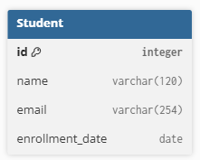
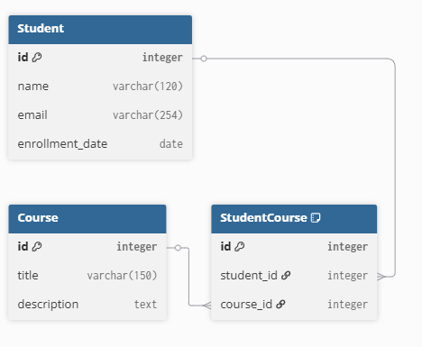
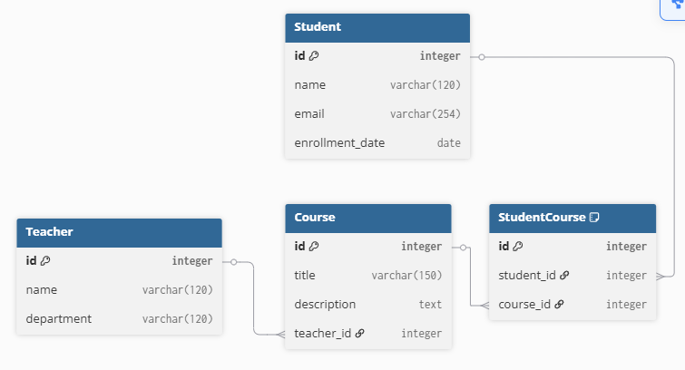
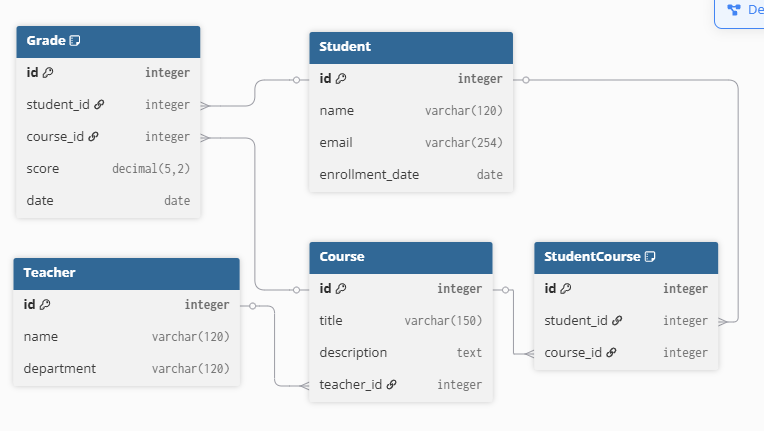
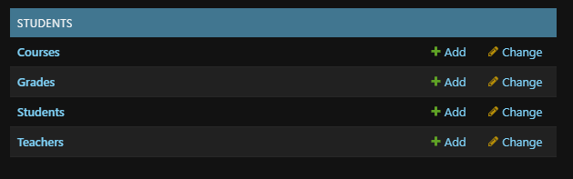

# Database Diagram — from first to final model

Below are the screenshots showing the schema evolution across four stages.

**Stage 1 — Base model (`Student`)**  
Single table with basic student fields (name, email, enrollment_date).  

**Stage 2 — Add `Course` and Student–Course relation**  
Introduces `Course` and a Many-to-Many link between `Student` and `Course` (via implicit/explicit pivot).  

**Stage 3 — Add `Teacher` (FK from `Course`)**  
Each course is assigned to one teacher (one-to-many Teacher→Course).  

**Stage 4 — Add `Grade` (final schema)**  
Stores a student’s score in a course; `Grade` has FKs to `Student` and `Course` (with uniqueness by date).  

## Admin (reference)

Screenshot of the **Django Admin → STUDENTS** section showing the registered models  
(Courses, Grades, Students, Teachers).

