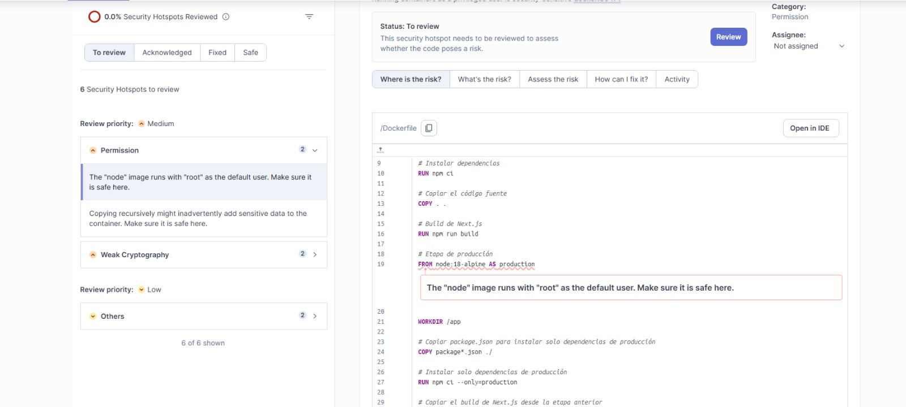
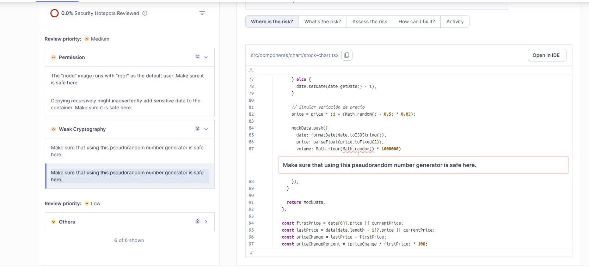
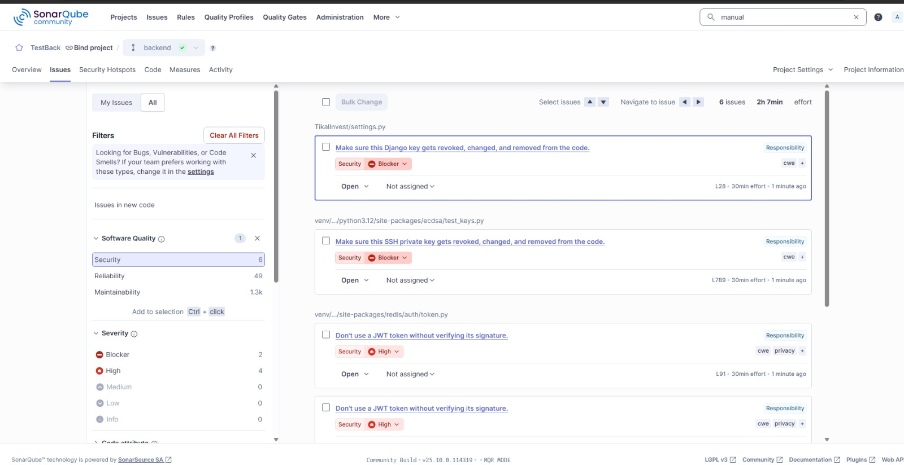
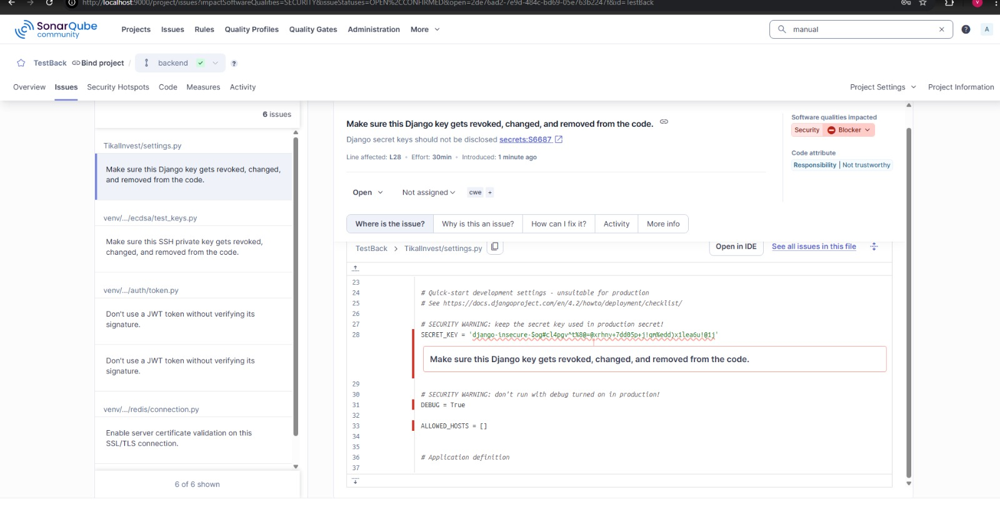
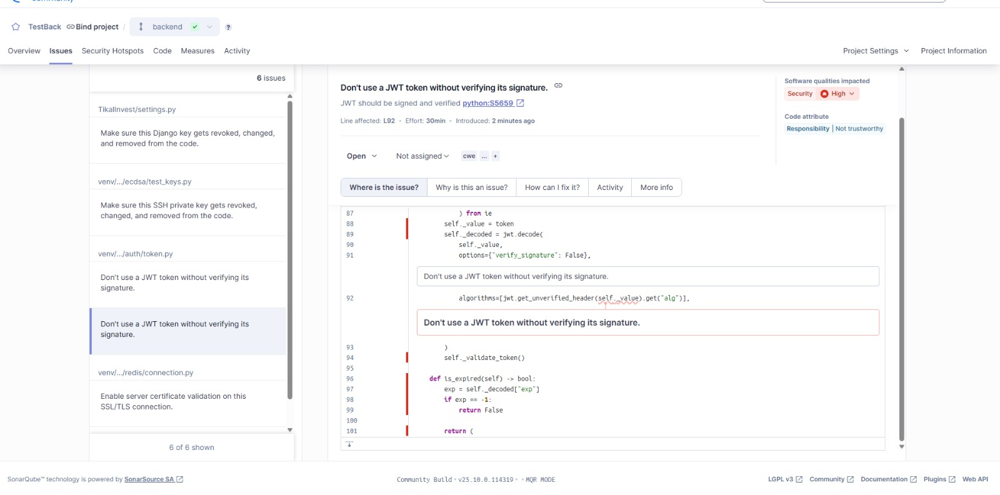

# HW-08

## Results Test

### Frontend

#### Dashboard 

#### Vulnerabilities

### Backend

#### Dashboard 

#### Vulnerabilities

# Start SonarQube and PostgreSQL
docker compose up -d

# Run backend (Python) analysis
pysonar --sonar-host-url=http://localhost:9000 --sonar-token=<backend-token> --sonar-project-key=backend

# Run frontend (Next.js) analysis
sonar -Dsonar.host.url=http://localhost:9000 -Dsonar.token=<frontend-token> -Dsonar.projectKey=frontend
