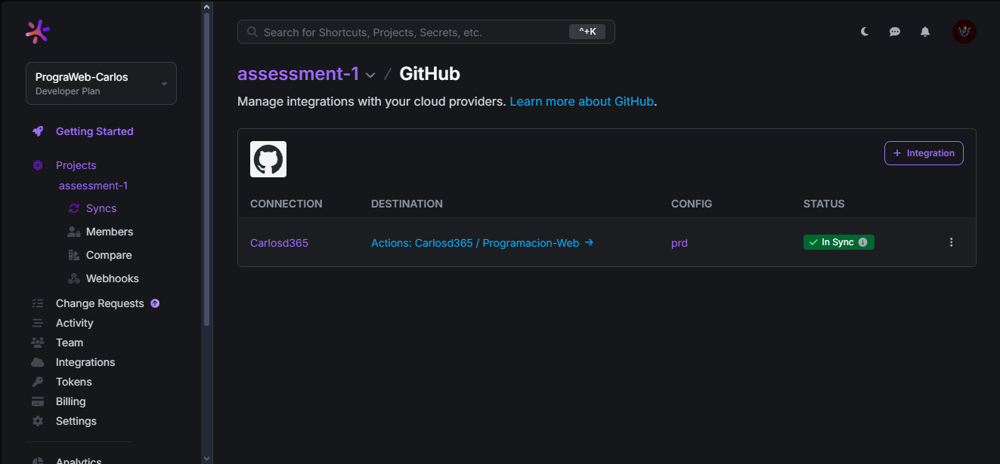
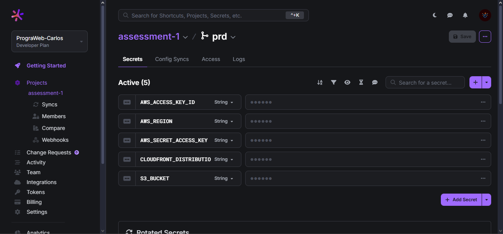
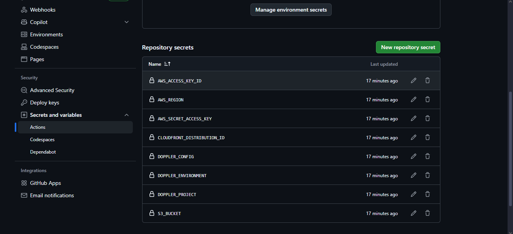
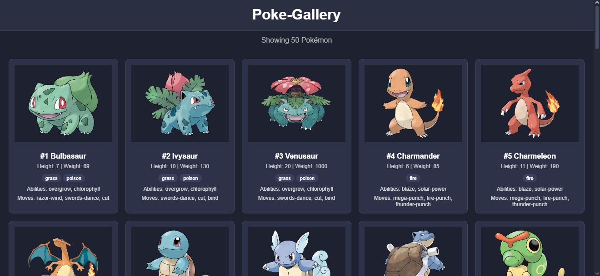

# Assessment-1 with Doppler, GitHub Secrets, and CloudFront

This document contains the requested evidence of the project configuration and integration with **Doppler**, **GitHub Secrets**, and **Amazon CloudFront**.

---

## 1. Screenshot – Doppler Config Syncs

This section shows the **Config Syncs** tab in Doppler, proving the integration with **this repository**.

---

## 2. Screenshot – Doppler Variables

This screenshot shows the variables configured in Doppler.

---

## 3. Screenshot – GitHub Secrets

This screenshot shows the secrets configured in the GitHub repository for integration and deployment.

---

## 4. Screenshot – Pokémon Cards

This screenshot shows the application running with dynamically generated Pokémon cards.

---

## 5. CloudFront CDN URL

The following URL provides access to the content distributed via **Amazon CloudFront**:

🔗 **[https://d3f6wkwwleh34p.cloudfront.net](https://d3f6wkwwleh34p.cloudfront.net)**
