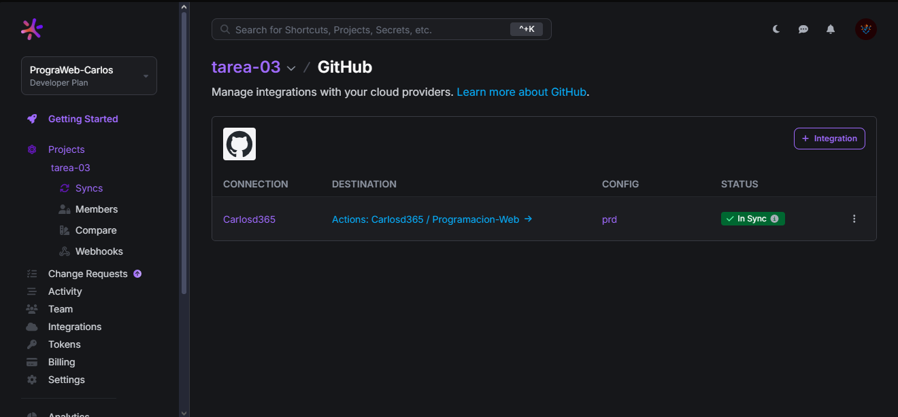
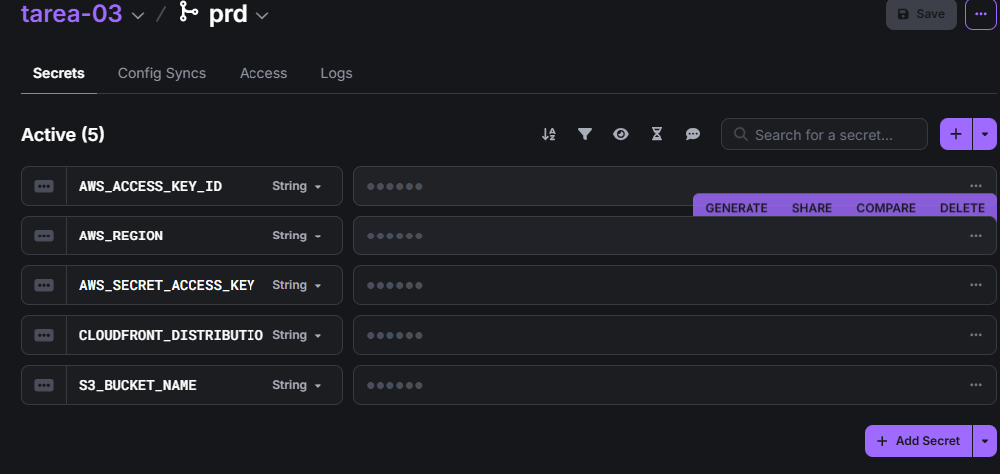
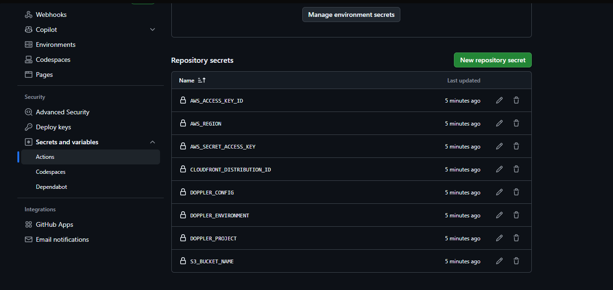

# Configuración del Proyecto con Doppler, GitHub Secrets y CloudFront

Este documento contiene las evidencias solicitadas de la configuración e integración del proyecto con **Doppler**, **GitHub Secrets** y **Amazon CloudFront**.

---

## 1. Captura de pantalla – Config Syncs de Doppler

En esta sección se muestra la pestaña **Config Syncs** de Doppler, evidenciando la integración con **este repositorio**.

## 2. Captura de pantalla – Variables de Doppler

En esta captura se pueden ver las variables configuradas en Doppler.

## 3. Captura de pantalla – Secretos de GitHub

Aquí se muestran los secretos configurados en el repositorio de GitHub para la integración y despliegue.

## 4. URL del CDN de CloudFront

La siguiente URL permite acceder al contenido distribuido mediante **Amazon CloudFront**:

🔗 **[https://d1h5yaqkxqz6oc.cloudfront.net](https://d1h5yaqkxqz6oc.cloudfront.net)**

